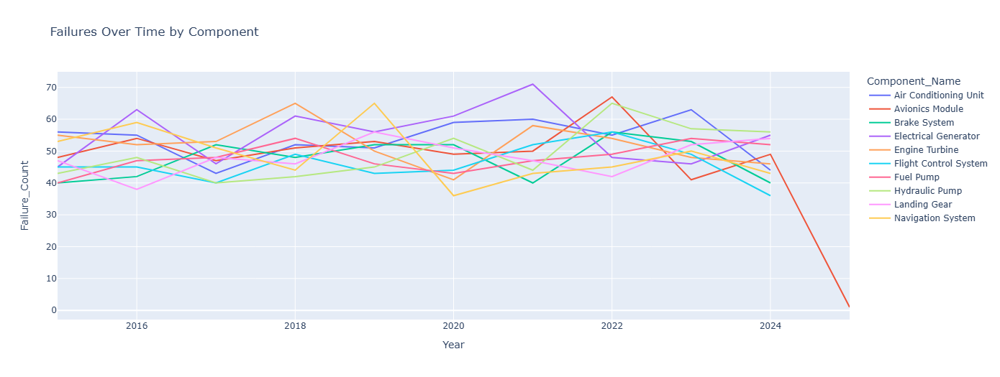

# ✈️ Aircraft Component Reliability Analysis & Predictive Maintenance

This project presents a comprehensive data analysis and machine learning pipeline tailored for a **Reliability Analyst** role in the aviation industry. It focuses on identifying high-risk components, analyzing downtime and repair cost trends, and developing predictive models to forecast imminent component failures.

VIDEO: https://drive.google.com/file/d/12pYbBJLRT2AwKJQ5TiuXsv-_WReYp8_1/view?usp=drive_link 
---

## 📌 Objective

To analyze aircraft component failure data to:
- Identify high-impact components and vendors
- Quantify downtime and repair cost burdens
- Build predictive models to anticipate imminent failures
- Enable proactive maintenance decisions and reliability optimization

---

## 📊 Project Overview

The notebook is structured in the following key steps:

### 1. Data Preprocessing
- Loaded and cleaned ~5,000 records of aircraft component failure data
- Engineered a target variable: **Failure Imminent** (MTBF < 400 hours)

### 2. Reliability Metrics & Trends
- Calculated MTBF, MTTR, and failure counts
- Visualized failure trends over time
    
- Highlighted components with highest risk

### 3. Cost & Downtime Analysis
- Analyzed **average repair cost** by component and vendor  
  
- Visualized **total downtime** per component  
  
- Built a **Pareto chart** to identify top contributors (80/20 rule)  
  

### 4. Vendor Performance
- Tracked failure trends by vendor over multiple years  
  
- Identified vendors with increasing or inconsistent reliability  
  

### 5. Predictive Modeling
- Trained 6 classifiers: Random Forest, Gradient Boosting, XGBoost, LightGBM, Logistic Regression, KNN  
  
- Achieved up to **91% accuracy** and **F1-scores > 0.89**  
  
- Evaluated performance with confusion matrices and classification reports  
  

### 6. Model Interpretability
- Visualized **feature importance** from tree-based models and logistic regression  
  
- Identified key predictors: **Flight Hours Since Install**, **Component Name**, and **Repair Cost**

---

## 🔍 Key Insights

- 🧨 **Electrical Generator** caused the most failures and downtime
- 📈 **Hydraulic Pump** failure frequency increased significantly over time
- 💸 **Flight Control System** had the highest average repair cost
- 📉 Just **4 components account for ~80%** of total downtime (Pareto rule)

---

## 📂 Files

- `Aircraft_Reliability_Analysis_Mukhesh.ipynb` – Full end-to-end notebook
- `Aircraft_Component_Reliability_Dataset.csv` – Cleaned dataset
- `README.md` – Project overview

---

## 💡 Tools & Libraries Used

- Python (Pandas, NumPy, Matplotlib, Seaborn, Scikit-learn, XGBoost, LightGBM)
- Plotly for interactive charts
- Jupyter Notebook

---

## 🎯 Use Case

This project simulates a real-world scenario a **Reliability Analyst** might face in aviation, aerospace, or MRO environments — making it ideal for technical interviews, portfolio demos, or business case presentations.

---

## 📬 Contact

Made with 💻 by Mukhesh Ravi  
📧 [mukheshravi195@gmail.com]  
🔗 [[LinkedIn Profile](https://www.linkedin.com/in/mukheshravi/)]
